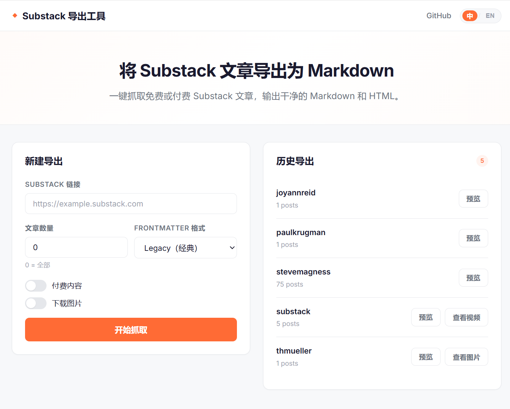
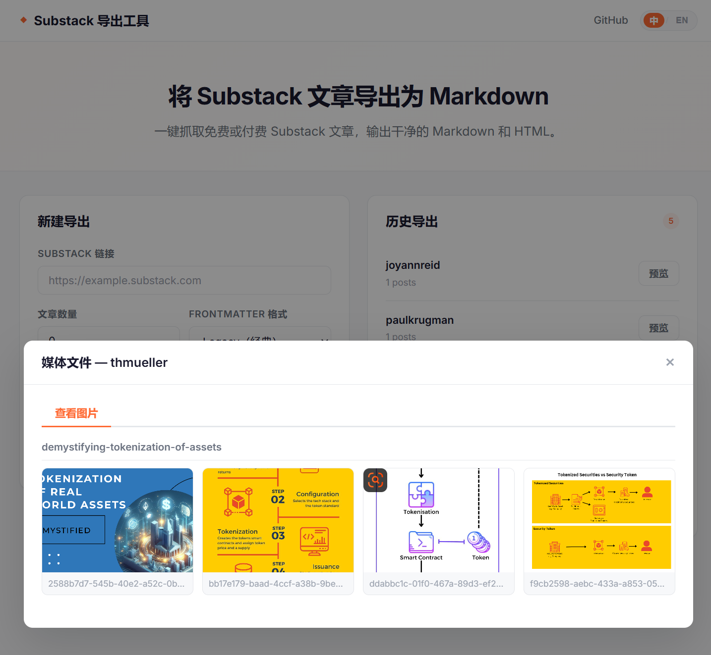
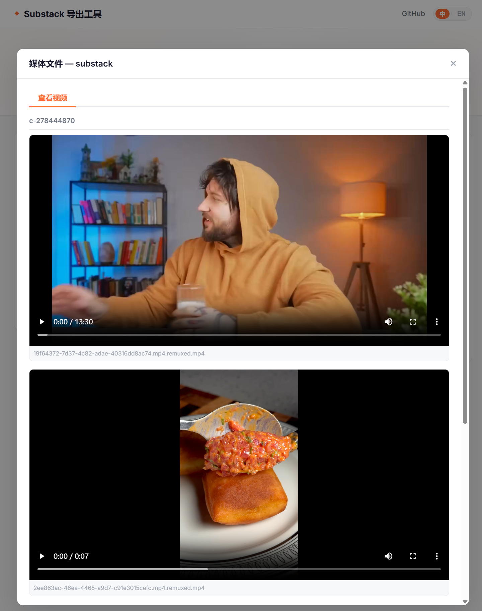

# substack-exporter

English | [中文](./README.md)

Substack and WeChat Official Accounts are essentially the same — both are self-media tools for individual creators, though Substack primarily serves an international audience. substack-exporter is a Python tool for downloading free and premium articles from Substack and saving them as Markdown and HTML files. It also includes a clean web UI for browsing and sorting articles. As long as you are subscribed to the Substack, it will save premium content.

## Screenshots

| Web Dashboard | Article List | Article Detail |
|:---:|:---:|:---:|
|  |  |  |

| Image Browser | Video Browser |
|:---:|:---:|
|  |  |

## Core Features

### Web Dashboard

- Modern web UI with one-click Chinese / English language switching
- Input a Substack URL, configure scraping options, and monitor progress in real time
- Export history management: browse author pages, preview Markdown, open file directories
- **Image & Video Browser**: view downloaded images in a grid and play videos online

### Command-line Tool

- Convert Substack articles to Markdown + HTML files
- Generate author index HTML (sortable by date / likes)
- Support both free and premium content (subscription + Selenium login required)
- Support scraping single article URLs (e.g. `/p/my-post`)

### Multimedia Download

- `--images` downloads article images locally and rewrites reference paths
- `--videos` downloads article videos (HLS streams, premium mode required), auto-remuxed to MP4 via ffmpeg
- Web UI supports image grid browsing and video playback with seeking support

### Metadata Formats

- Legacy classic format and MDX (YAML frontmatter) output options
- Auto-extracts title, date, author, cover image, like count, and more

## Installation

```bash
# Clone the repo
git clone https://github.com/yourname/substack-exporter.git
cd substack-exporter

# Create a virtual environment (recommended)
python -m venv venv

# Activate
.\venv\Scripts\activate    # Windows
# source venv/bin/activate # Linux/Mac

# Install dependencies
pip install -r requirements.txt
```

> **Video downloads require ffmpeg**. Windows: `winget install ffmpeg`, or download from [ffmpeg.org](https://ffmpeg.org/download.html).

## Usage

### Web Dashboard (Recommended)

```bash
python web_server.py
```

Open `http://127.0.0.1:5000` in your browser:

| Feature | Description |
|---------|-------------|
| New Export | Enter a Substack URL, choose free/premium, images/videos, article count |
| Progress Monitor | Real-time scraping progress and logs |
| History | View previously scraped authors, preview articles and Markdown files |
| Media Browser | Click "View Images" / "View Videos" to browse multimedia online |
| Premium Login | Click "Login" to open a browser and sign into Substack; session reused automatically |
| Language | Top-right **中文 / EN** toggle |

> The web dashboard runs `substack_scraper.py` as a subprocess. All output directories are identical to the CLI version.

### Command Line

#### Free Articles

```bash
# Scrape all free articles
python substack_scraper.py --url https://example.substack.com

# Scrape a specific number
python substack_scraper.py --url https://example.substack.com --number 10

# Scrape a single article
python substack_scraper.py --url https://example.substack.com/p/my-post
```

#### Premium Articles (Chrome or Edge required)

First run (opens browser for manual login / CAPTCHA):

```bash
python substack_scraper.py --url https://example.substack.com --premium --persistent-profile
```

Subsequent runs (reuse saved session):

```bash
python substack_scraper.py --url https://example.substack.com --premium --persistent-profile --skip-login
```

#### Download Images and Videos

```bash
# Download article images
python substack_scraper.py --url https://example.substack.com --images

# Download videos (requires premium mode + ffmpeg)
python substack_scraper.py --url https://example.substack.com --premium --persistent-profile --skip-login --videos
```

#### Other Options

```bash
# MDX-compatible YAML frontmatter
python substack_scraper.py --url https://example.substack.com --frontmatter mdx

# Custom save directory
python substack_scraper.py --url https://example.substack.com --directory ./my_md_files
```

## Configuring Premium Access

To scrape premium content, edit `config.py` in the project root:

```python
EMAIL = "your-email@domain.com"
PASSWORD = "your-password"
```

> Note: `config.py` is gitignored and will not be committed. The web dashboard's "Login" button opens a visible browser for CAPTCHA completion; the config file is only used as credentials for CLI-based login.

## CLI Arguments Reference

| Argument | Description |
|----------|-------------|
| `-u, --url` | Substack URL |
| `-d, --directory` | Markdown save directory (default: `substack_md_files`) |
| `-n, --number` | Number of articles to scrape (0 = all) |
| `-p, --premium` | Premium mode (enables Selenium login) |
| `--browser` | Browser: `chrome` (default) or `edge` |
| `--headless` | Headless mode (may trigger CAPTCHA) |
| `--persistent-profile` | Persist browser login state |
| `--skip-login` | Skip login (use with `--persistent-profile`) |
| `--images` | Download images locally |
| `--videos` | Download videos (requires premium + ffmpeg) |
| `--frontmatter` | `legacy` (default) or `mdx` |
| `--chrome-driver-path` | Custom chromedriver path |
| `--edge-driver-path` | Custom msedgedriver path |

## Output Structure

| Directory | Content |
|-----------|---------|
| `substack_md_files/<author>/` | `.md` files for each article |
| `substack_html_pages/<author>/` | `.html` files and author index page |
| `data/<author>.json` | Article metadata (title, date, likes, etc.) |
| `substack_images/<author>/` | Downloaded images (requires `--images`) |
| `substack_videos/<author>/` | Downloaded videos (requires `--videos`, ffmpeg remuxed to MP4) |

Open `substack_html_pages/<author>.html` to browse all articles sorted by date or likes.

## Project Structure

```
substack-exporter/
├── substack_scraper.py      # Main entry point (CLI)
├── web_server.py             # Web dashboard backend (Flask)
├── templates/
│   └── index.html            # Web dashboard page
├── static/
│   ├── css/web-ui.css        # Web dashboard styles
│   └── js/web-ui.js          # Web dashboard logic + i18n (zh/en)
├── config.py                 # Premium login credentials (fill in yourself)
├── author_template.html      # Author index HTML template
├── requirements.txt          # Python dependencies
├── Screenshot/               # Screenshots
├── assets/
│   ├── css/                  # Stylesheets
│   ├── js/                   # Frontend JS (sorting / switching)
│   └── images/               # Image assets
├── tests/
│   └── test_substack_scraper.py  # Unit tests
├── data/                     # Article metadata JSON (runtime)
├── substack_md_files/        # Downloaded Markdown files (runtime)
├── substack_html_pages/      # Browsable HTML pages (runtime)
├── substack_images/          # Downloaded images (runtime)
└── substack_videos/          # Downloaded videos (runtime)
```

## Running Tests

```bash
pytest tests/ -v
```

## FAQ

**Q: Browser driver error?**

A: The script auto-detects your browser version and downloads the matching driver to `~/.substack_exporter/drivers/`. If it fails, manually download the driver and specify the path with `--chrome-driver-path`.

**Q: Premium login fails / CAPTCHA appears?**

A: Remove `--headless`, add `--persistent-profile`, complete the CAPTCHA manually, then use `--skip-login` on subsequent runs. We recommend using the Web Dashboard's "Login" button, which opens a visible browser window automatically.

**Q: "Too many requests" error?**

A: The script has built-in retry logic (exponential backoff + jitter). If it happens frequently, try reducing `--number` and scraping in batches.

**Q: Downloaded videos won't play?**

A: TS segments downloaded from HLS streams need to be remuxed to MP4 via ffmpeg. Make sure ffmpeg is installed and in your PATH. The scraper calls ffmpeg automatically during download; existing old files are auto-converted on first access in the web dashboard.

## Community

QQ Group: **166710269**

Feel free to join to discuss Substack usage, report issues, and share suggestions.

## Support the Author

If this project helps you, consider buying the author a coffee ☕


## License

MIT License — see [LICENSE](LICENSE)
